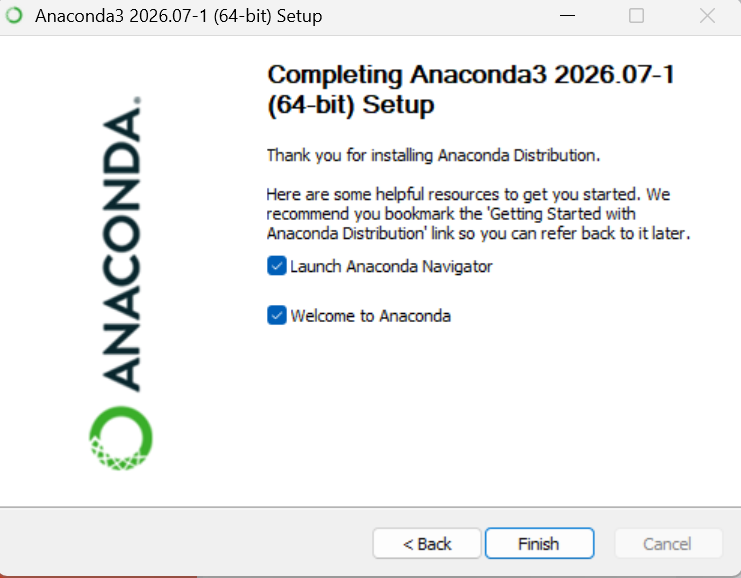
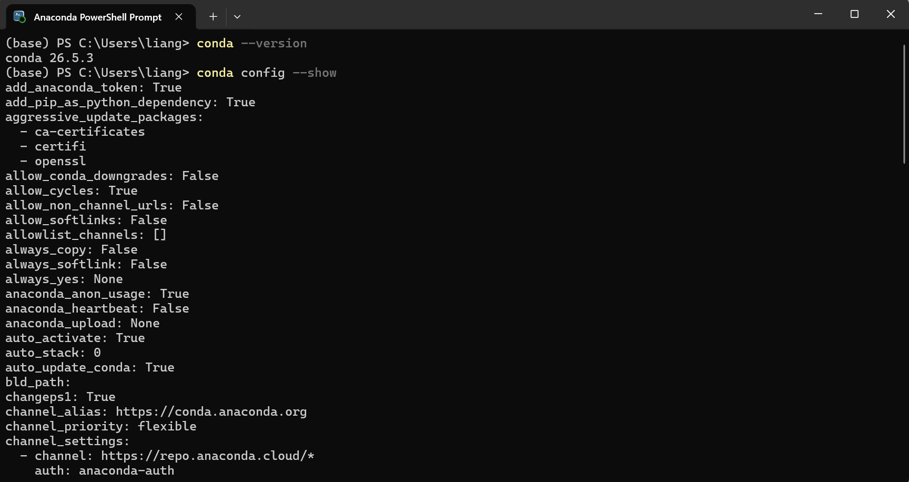
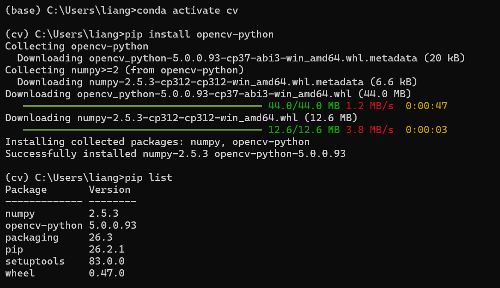
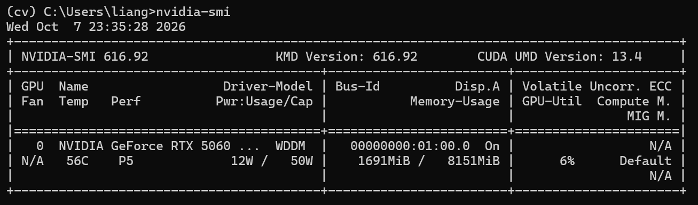
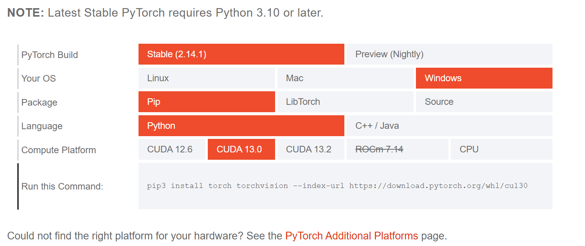
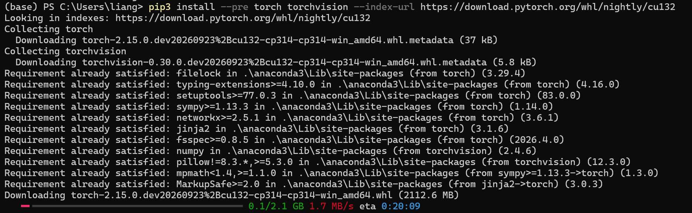

# 实验一：计算机视觉库的安装

###202410315032-人工智能241-梁旭

## 一、实验目的
掌握 Anaconda 的安装与基本操作，熟悉 GPU 使用环境的配置及对应版本 PyTorch 的安装，并完成 OpenCV 的安装与配置。

## 二、实验内容

### 2.1 Anaconda的安装及配置

#### 1.在Anaconda官网下载Anaconda


#### 2.在Anaconda Prompt中完成Anaconda的配置

```
conda --version    # 查看 conda 版本
conda config --show    # 查看 conda 全部配置信息
```


### 2.2 conda的基本操作与OpenCV的安装

#### 1. 创建虚拟环境并制定python版本

```
conda create -n cv python==3.12    # 创建名为cv的conda虚拟环境，指定Python版本为3.12
```

#### 2. 安装OpenCV

```
conda activate cv    # 激活名称为cv的conda虚拟环境
pip install opencv-python    # 在当前cv环境中安装opencv‑python库
pip list    # 列出当前虚拟环境已经安装的所有包及对应版本
```


### 2.3 GPU加速环境配置

#### 1.显示显卡状态信息

```
nvidia-smi
```


#### 2.在NVIDIA官网下载对应版本的CUDA Toolkit及cuDNN并安装。

### 2.4 PyTorch安装

#### 1. 结合CUDA版本至PyTorch官网选择对应版本进行下载，页面如下：


```
pip3 install torch torchvision --index-url https://download.pytorch.org/whl/cu132
```

#### 2.验证安装成功

```
conda list pytorch    # 查看当前conda环境中，名称包含pytorch的已安装包
```


### 2.5 PyTorch GPU加速环境验证
torch.cuda.is_available() 、 torch.backends.cudnn.is_available() 结果进行验证，信息如下：


验证通过！

## 三、实验结果分析
通过在 Anaconda 环境下操作，成功配置pytorch虚拟环境，安装了 Pytorch、OpenCV库。经 PyTorch GPU加速环境验证，说明安装有效，环境适配，满足计算机视觉实验需求。

## 四、实验小结
通过本次实验，掌握了基于 Anaconda 的计算机视觉开发环境搭建流程，熟悉了 Conda 虚拟环境的创建、配置与管理方法。实验过程中成功完成了 Anaconda 的安装，并利用 Anaconda Prompt 对环境信息进行了查看和配置，为后续深度学习框架的安装与使用提供了基础环境支持。

在虚拟环境配置过程中，创建了指定 Python 版本的 cv 环境，并在该环境下完成了 OpenCV 库的安装与测试，进一步了解了 Python 第三方库的管理方法。同时，通过 pip list 和 conda list 等命令掌握了环境中已安装软件包的查看方式。

在 GPU 加速环境配置部分，通过 nvidia-smi 命令查看显卡信息，并根据显卡驱动版本配置对应的 CUDA Toolkit 和 cuDNN 环境，加深了对深度学习计算加速环境搭建流程的理解。随后，根据 CUDA 版本选择并安装了对应版本的 PyTorch，通过 torch.cuda.is_available() 和 torch.backends.cudnn.is_available() 等方法验证 GPU 加速功能，确认 PyTorch 能够正常调用 CUDA 进行计算。

通过本次实验，完成了计算机视觉实验所需开发环境的搭建，掌握了 Anaconda、OpenCV、PyTorch 以及 GPU 加速环境的基本配置方法，为后续图像处理、深度学习模型训练以及计算机视觉相关实验奠定了良好的基础。同时也认识到，在配置深度学习环境时，需要注意 Python、CUDA、cuDNN 与 PyTorch 版本之间的兼容性，以保证开发环境的稳定运行。
